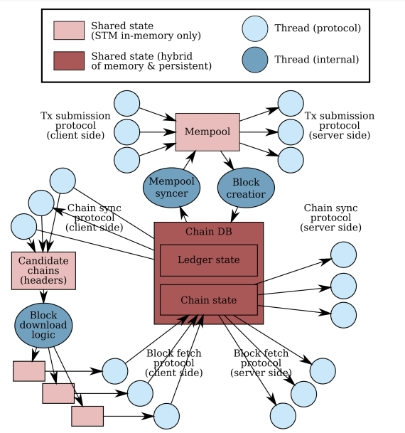

The Cardano network is a technical infrastructure combining Cardano nodes and their relative interactions in one unified system. It consists of a collection of nodes that communicate with each other to maintain the distributed ledger. These nodes are the actors on Cardano that validate blocks, add blocks to the chain, and distribute transactions. 

The networking layer is the driving force for delivering information exchange requirements, which includes new blocks diffusion and transaction information for establishing a better data flow. Cardano nodes maintain connections with peers that have been chosen via a custom peer selection process.  

Follow these links to find detailed specifications of:

+ [The Shelley networking protocol](https://hydra.iohk.io/build/5866649/download/2/network-spec.pdf) 
+ [An introduction to the design of data diffusion and networking for Cardano Shelley.](https://hydra.iohk.io/build/4110312/download/1/network-design.pdf)  

## Data flow between and within nodes 
To understand how nodes communicate with each other, let’s suppose that node *A* is connected to node *B*. Then, the Ouroboros protocol schedules a node *N* to generate a new block in a given time slot. Depending on the location of nodes *A*, *B*, and *N* in the network topology, and whether a new block arrives first at *A* or *B*, node *A* can be either upstream or downstream of node *B*. 

A set of mini protocols is used to enable communication between different nodes. Each mini protocol implements a basic information exchange requirement, such as informing peers of the latest block, sharing blocks as needed, or sharing new transactions around the Cardano network. For connection purposes, mini protocols are determined by the version of the network protocol. For example, there are two protocol suites: node-to-node and node-to-client. The node-to-client protocol suite is used by wallets and chain consumers. Protocol suites use different sets of mini protocols and the version is negotiated when a new connection is established using a specific protocol (protocols are described in the following sections). 

Clients can also choose which node-to-client mini-protocols to use, but it is important to note that the node needs to be able to reply to all of them to support different use cases. For example, to communicate, node A runs its client-side instance of the *chain-sync mini protocol* that talks with a server instance of the *chain-sync mini protocol* at node *B*. Such a situation is similar to the functionality of other mini protocols.  

The scheme below illustrates how data flows within a node. Circles represent protocol threads and internal threads that are responsible for running the client and server processes within the respective mini protocols. 

Two types of data flow exist:
1. Mini protocols communicate with mini protocols of other nodes by sending and receiving messages across a public network (internet); 
this flow is not covered within the scheme above but will be potentially designed for better understanding. 
2. Within a node, mini-protocols communicate with each other by reading from, and writing to, a shared mutable variable, which is represented by boxes in the scheme. Arrows indicate whether a thread has *read* or *write* access to the shared state.

## Addressing network complexities and constraints
To design an efficient and robust networking architecture, a number of potential issues regarding complexity and constraints have been evaluated. 

**Congestion control** is one such feature and is used to deal with system overload. Congestion control is vital to ensure that the system is robust enough while operating high workloads. Within the networking design, it is common that the number of transactions that occur can be higher than the number that can be actually processed for inclusion in the blockchain. Therefore, it is important to ensure that the increasing rate of transaction submission into a block does not decrease the performance of blockchain. 

The actual node has a limit to the amount of data it can process. In particular, a node might have to share its processing power with other processes that run on the same machine or operating system instance. This means that a node can slow down and result in the system not being able to process all the available data from the network.

To address these issues, the congestion control feature has been designed to operate appropriately in such a situation and recover from transient conditions. In any case, a node must not exceed its memory limits so there must be defined memory limits, breaches of which are treated as protocol violations. These factors mean that the system will be able to meet performance goals. 

**Real-time constraints** and **coordinated universal time** are other aspects that have been considered while designing the networking architecture. In Cardano, Ouroboros consensus protocols model the passage of physical time as an infinite sequence of time slots, assigning slot leaders to create a new block in those time slots. Choosing a slot time, however, might cause certain complexities in terms of the slot length, as it should be long enough for a new block to have a good chance to reach the next slot leader in time. Therefore, a chosen value for the slot length was initially set to 20 seconds in the Byron era. With [Ouroboros Praos](https://eprint.iacr.org/2017/573.pdf) now implemented in the Shelley era, a slot length of 1 second is chosen but, on average, only 0.05 of slots will produce a block (and thus on average, there will be 20-second intervals between blocks). It is assumed that the clock skews between local clocks of the nodes is small with respect to the slot length. Possible clock inaccuracies should still be taken into consideration, especially when dealing with time-stamped incoming blocks. It is important to differentiate whether there is a time difference or whether the node considers an adversarial behavior of another node.

## Utilizing mini-protocols 
Mini protocols are used to communicate between multiple nodes while implementing information exchange requirements. A mini protocol is a defined modular building block of the network protocol. Structuring the network protocol around mini protocols helps to manage the overall complexity of the design while ensuring useful flexibility. 

Mini protocols describe both the *initiator* and the *responder* within the communication stream. The initiator is the dual element of the responder and vice versa. A node typically runs many instances of mini protocols, which includes many instances of the same mini protocol. Each mini protocol instance of the node then communicates with the dual instance of the exact peer. All mini protocols that communicate with the same peer share a single communication channel (pipe or socket). A multiplexer or de-multiplexer is used to multiplex respective protocols over that channel. 

The set of mini protocols that is used for connection between two participants of the system depends on the role of these participants, for instance, whether the node acts as a full node or a blockchain consumer (for example, a wallet).

It is also worth noting that the implementation of mini protocols uses a generic framework for **state machines**. This framework uses *correct-by-construction* techniques to guarantee the implementation of several properties of the protocol. In particular, this technique assures that no deadlocks occur and communication is cancelled in the following scenarios:

- when one side is expected to transmit the next message, and the other side is awaiting the message, and both sides agree that the protocol has been terminated
- when either side receives a message that is not expected according to the protocol

All mini protocols based on this framework include the following information in their description:

- an informal description of the protocol
- state machine states
- exchanged messages
- a transition graph of the state machine global view
- the client’s implementation of the protocol
- the server implementation of the protocol

## Example mini protocols
This section outlines some examples of mini protocols. 

### Ping Pong protocol
This is a simple protocol for testing that a client can use to check that the server is responsive. The Ping-Pong protocol is very simple because the messages do not carry any data and the Ping-Pong client, as well as the Ping-Pong server, do not access the internal state of the node.

### Request Response protocol
The request response protocol is polymorphic in the request and response data that is being transmitted. This means that there are different possible applications of this protocol and the application of the protocol determines the types of requests sent and responses received.

### Chain Synchronisation protocol
The chain synchronization protocol is used by a blockchain consumer to replicate the producer’s blockchain locally. A node communicates with several upstream and downstream nodes and runs an independent client instance and an independent server instance for each node with which it communicates. 

The chain synchronization protocol is polymorphic. The node-to-client protocol uses an instance of the chain synchronization protocol that transfers full blocks, while the node-to-node instance only transfers block headers. In the node-to-node scenario, the block fetch protocol is used to transfer full blocks.

### Block Fetch protocol
The block-fetching protocol enables a node to download a range of blocks.

### Local Transaction Submission mini protocol
The local transaction submission mini protocol is used by local clients, for example, wallets or CLI tools, to submit transactions to a local node. The protocol is not used to forward transactions from one core node to another. 
The protocol follows a simple request-response pattern:
1. the client sends a request with a single transaction.
2. the server either accepts the transaction (returning a confirmation), or rejects it (returning the reason).

### Node-to-Node Transaction Submission protocol
The node-to-node transaction submission protocol is used to transfer transactions between full nodes. The protocol follows a pull-based strategy where the initiator asks for new transactions and the responder replies with transactions. It is suitable for a trustless setting where both sides need to guard against resource consumption attacks from the other side. The implementation of the node-to-node transaction mini protocol is based on a generic mini protocol framework (the same as for all other mini protocols). For technical reasons, the roles of the initiator and the responder are reversed in this case compared to the way other mini protocols are implemented in the framework. In other words, the server is the initiator who requests new transactions, and the client is the responder who replies with transactions. 

### Handshake mini protocol
The handshake mini protocol is used to negotiate the protocol version and the protocol parameters that are used by the client and the server. It is used first when a new connection is initialized and consists of a single request from the client and a single reply from the server. The handshake mini protocol is a generic protocol that can negotiate any kind of protocol parameters. It assumes that protocol parameters can be encoded to, and decoded from Concise Binary Object Representation (CBOR) terms. A node that runs the handshake protocol must instantiate it with the set of supported protocol versions and callback functions for handling the protocol parameters. These callback functions are specific for the supported protocol versions.

