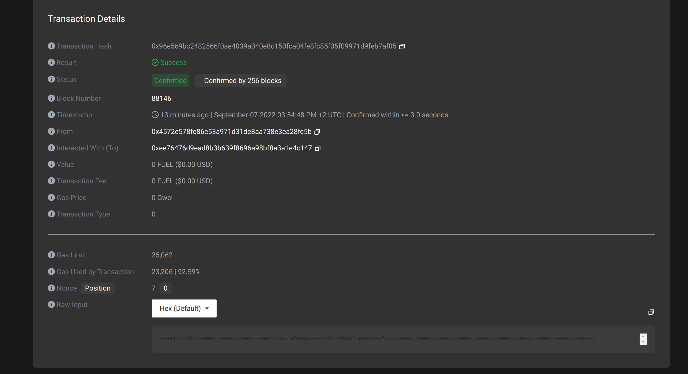
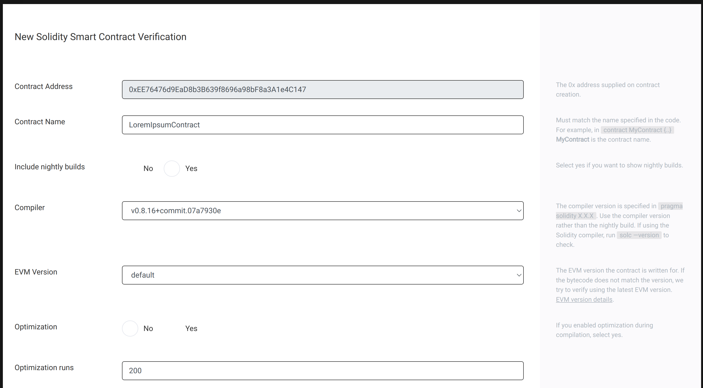
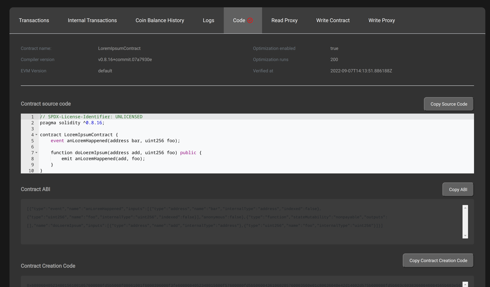

## What is verification?

Verification of a smart contract does two things:   
- It assures you that the copy of a smart contract on the blockchain matches your source code
- It makes the source code of your smart contract available to all other users of the same blockchain explorer.   

As a consequence of verification, you provide transparency and reassurance to the users of your smart contract.

## Note
In the initial release of the Cardano sidechains toolkit, the contract verification functionality in the EVM sidechain testnet block explorer is deprecated. The functionality will be restored in a subsequent release and this disclaimer will be removed when that is done.

## Prerequisites
You need access to the source code of the contract before you start. This can be in the form of flattened source code, Standard Input JSON, or Vyper source.  

There are several publicly available products to flatten source code; that is to incorporate all included files into one file.

## Accessing the block explorer 
From any supported browser, go to the URL http://explorer.sidechain.evmtestnet.iohkdev.io/. 

The main screen shows the current head of the chain.

## Block explorer main screen

  

In the above image of the block explorer, note the hash of the top transaction call.

## Detail screen

When clicking on the hash of a transaction, you will see its details:  

  

You can see the status of the transaction (success or failure) and the smart contract it was executed against (if the transaction is a smart contract call).  

## Contract page

Click on the contract address (labeled either `To: [Contract  0x.... created]` or ` Interacted With 0x...`)  

 

## Code tab

On this page, after scrolling down you can see tabs, one of them being 'Code'. Clicking it will show known code if it exists, or raw bytes of the contract if the source is not known. 

  

## Verifying a contract 

In the first row of the code tab, there is a link to verify the contract.   

   

You can choose to verify using one of these methods:  
- Via flattened source code
- Via Standard Input JSON
- Vyper contract
   
Other verification methods may be added later. 

The next two images show the contract verification form: 

  

  
  
After the forms have been completed and submitted, you will see the results of the verification, eg:  

   
Now the smart contract can be inspected by any other user of the block explorer.
