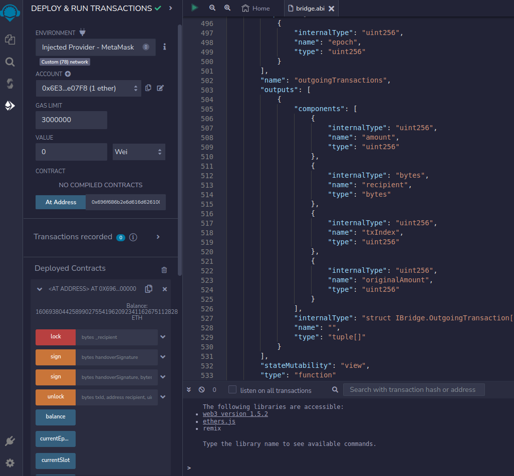
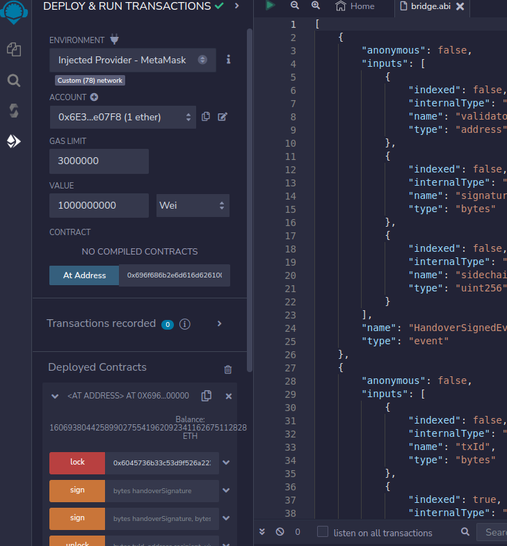

This tutorial will show you how to transfer `SC_Tokens` between the main chain and a sidechain.

## Prerequisites

1. **sidechain-evm-cli** is used within this tutorial and is in the SC_EVM repository [here](https://github.com/input-output-hk/mamba-world/tree/open-source/tooling).
2. Download the **bech32** conversion tool binary and add to your shell's path: https://github.com/input-output-hk/bech32.
3. If you have not done so already, create and fund your main chain and sidechain accounts.
4. The bridge contract source which can be used to compile Solidity or obtain the ABI is in the SC_EVM repository [here](https://github.com/input-output-hk/mamba-world/blob/open-source/src/solidity-bridge/contracts/Bridge.sol).

# Transfering tokens from a sidechain to the main chain

Transferring `SC_Token` from a sidechain to the main chain will require interfacing with the bridge smart contract to lock your desired amount of `SC_Token` to be claimed on the main chain. In this guide, you will use RemixIDE to interface with the bridge contract.


### Step 01 - Setup contract interface in RemixIDE

- Go to https://remix.ethereum.org/

- Get the contents of the bridge contract solidity or ABI from the sc-evm repository [here](https://github.com/input-output-hk/sc-evm/blob/main/src/solidity-bridge/contracts/Bridge.sol).

*Note: Make sure your Remix-compatible Web3 provider is configured to the EVM sidechain testnet. Eg: MetaMask.*

- In Remix, go to **Deploy and Run transactions** > select **Injected Provider (MetaMask)** for the environment > Load contract from address (`0x696f686b2e6d616d626100000000000000000000`)

Your RemixIDE will look similar to this with a contract interface: 

### Step 02 - Lock SC_Token

The `lock` function of the bridge contract takes the main-chain recipient's address, but **the recipient address must be converted to bech32 format**.

- Convert main-chain address to bech32 format: 

```shell
./bech32 <<< addr_test1vpzhx6enc57e75n2ygcgdt7cz2c8akt5rk5qaxy7j6vc3ycgly0wh
6045736b33c53d9f526a223086afd812b07ed9741da80e989e96998893 #Returns the conversion
````

To ensure the address is recognized as a HEX string simply add `0x` to the beginning of the converted address, eg: `0x6045736b33c53d9f526a223086afd812b07ed9741da80e989e96998893`

- Determine how many `SC_Token` you want to lock. The amount in `SC_Token` has to be a multiple of 10^9. For example, 10^9 `wei` on the sidechain will be 1 `SC_Token` on the main chain.
Input the amount of `SC_Token`, in `wei`, you want to lock: eg, `1000000000` Wei == 1 `SC_Token`. Your Remix should look similar to this: 
- Select the `lock` button to initiate the transaction and follow the MetaMask prompts to confirm and sign the transaction.

*Note: If the transaction appears to be stuck, 'pending' status, or MetaMask shows an invalid balance, try [resetting MetaMask](https://metamask.zendesk.com/hc/en-us/articles/360015488891-How-to-reset-an-account) and submit the transaction again.*

- To get the transaction hash or verify that the transaction was successful, you can check MetaMask activity or the Remix console: 
  - Alternatively, you can invoke the `eth_getTransactionReceipt` API method. You can request this until the receipt is returned or transaction times out:
  ```shell
  curl -L -X POST -H 'Content-type:application/json' -d '{
  "jsonrpc": "2.0",
  "method": "eth_getTransactionReceipt",
  "params": [INSERT_RAW_TX],
  "id": 1
  }' https://localhost:8546 | jq
  ```

#### Step 03 - Wait for transaction to be processed and obtain MerkleProof

- Get the current sidechain status by invoking `sidechain_getStatus`:

```shell
curl -L -X POST -H 'Content-type:application/json' -d '{
   "jsonrpc": "2.0",
   "method": "sidechain_getStatus",
   "params": [],
   "id": 1
   }' https://localhost:8546 | jq -r
```

This shows on which epoch and phase the `lock()` transaction happened. If it happened during epoch `N` on epochPhase `regular` you can obtain the Merkle proof on epoch `N` since epochPhase changes to `handover`. If it happened during epoch `N` on epochPhase `closedTransactionBatch` or `handover`, you can obtain the Merkle proof on epoch `N+1` since epochPhase changes to `handover`.

- Get transaction index for the epoch the lock transaction will be processed by invoking the `sidechain_getOutgoingTransactions` API method:

```
curl -L -X POST -H 'Content-type:application/json' -d '{
  "jsonrpc": "2.0",
  "method": "sidechain_getOutgoingTransactions",
  "params": [<N or N+1>],
  "id": 1
  }' https://localhost:8546 | jq
```

Example output:

```json
{
  "jsonrpc": "2.0",
  "result": {
    "transactions": [
      {
        "value": "0x1",
        "recipient": "0x6041e633c6b54572165a1563291c147dadb803667c99fc8c55ff3762fb",
        "txIndex": 0
      }
    ]
  },
  "id": 1
}
```

To obtain the `merkleProof` matching the recipient and amount used to lock tokens, proceed as follows.

- Wait until the epochPhase changes to `handover` of epoch `N` or `N+1` and obtain the Merkle proof for your lock action by invoking the `sidechain_getOutgoingTxMerkleProof` API method:

```shell
curl -L -X POST -H 'Content-type:application/json' -d '{
  "jsonrpc": "2.0",
  "method": "sidechain_getOutgoingTxMerkleProof",
  "params": [<N or N+1>, <txIndex>],
  "id": 1
  }' https://localhost:8546 | jq
```

Example: 

```
curl -L -X POST https://localhost:8546 -H 'Content-type:application/json' -d '{"jsonrpc": "2.0", "method": "sidechain_getOutgoingTxMerkleProof", "params": [1295, 1], "id": 1}' | jq

{
  "jsonrpc": "2.0",
  "result": {
    "proof": {
      "bytes": "0xd8799fd8799f0101581d6045736b33c53d9f526a223086afd812b07ed9741da80e989e96998893d8799f5820772485d60f6744cf252f26560413aae8d28c82a88b1c77eede792f28965f4e79ffff9fd8799f005820ed69142610619b748ec5cd657e418c1c891c3a176900376d12db0b3c406a0a38ffffff",
      "info": {
        "transaction": {
          "value": "0x1",
          "recipient": "0x6045736b33c53d9f526a223086afd812b07ed9741da80e989e96998893",
          "txIndex": 1
        },
        "merkleRootHash": "0xaacd27079b9c8b8bd17693beccb8997b4b7b1ef97596018d43047a40dab6b021"
      }
    },
    "sidechainEpoch": 1295
  },
  "id": 1
}
```

From the return you need to obtain the `proof/bytes` and remove the `0x` that is prepended. Call that string `merkleProof`. 

*In the above example `d8799fd8799...` is the Merkle proof.*

Wait until the epoch changes and the committee handover has happened. 

*Note: A sidechain epoch is 1 hour; 30 minutes in the `regular` phase, 15 minutes in `closedTxBatch` phase, and 15 minutes in `handover` phase.*

The committee handover happens automatically on the testnets by a service (relay) that tries every minute to find epoch signatures, and succeeds after a new epoch has started and the signatures are obtained. On mainnet, the committee handover will be done by anyone who wants, where there will be an incentive to do so. A good way to verify this is to wait until you observe your transaction in the list of signatures to upload:

```
curl -L -X POST -H 'Content-type:application/json' -d '{
    "jsonrpc": "2.0",
    "method": "sidechain_getSignaturesToUpload",
    "params": [<limit>],
    "id": 1
    }' https://localhost:8546 | jq
```

Where `limit` = min(limit, number of epochs that are not yet relayed). The default value is `100`, but you can set it to any other number. Normally, when the handover happens at every epoch, it should only show 0 or 1 epochs (the last one). Once you identify that there are no roothashes pending in the list under the epoch that your lock was processed (`N` or `N+1`), you can claim your tokens. By now the epoch will be `N+1 `or `N+2`, depending on the phase you performed the lock operation in.

#### Step 04 - Claim SC_Token

- Claim the tokens by submitting a transaction on the main chain with the `merkleProof` you obtained using the **sidechain-cli**. You will need to sign the transaction with your main chain signing key (ex: `payment.skey`):

```shell
./sidechain-cli claim-sc-token \
--sc-evm-url https://localhost:8546 \
--signing-key-file /PATH/TO/payment.skey \
--combined-proof <merkleProof without 0x>
```

Example output: 

```
{
  "endpoint": "ClaimAct",
  "transactionId": "1334b3dab421911af68b9393e5cc4756c46c9ab1ac567a57450597e174351a48"
}
```
**Warning:** Please note that this command can take some minutes to complete.  


🎉 Congratulations! At this point, you have successfully claimed your `SC_Token` on the main chain.

# Transfering tokens from the main chain to a sidechain

### Step 01 - Burn SC_Token

To transfer `SC_Token` from the main chain to a sidechain, use the **sidechain-cli** to burn main-chain `SC_Token`.

```
sbt "scEvmCli/run burn-sc-token \
--signing-key-file payment.skey \
--sc-evm-url https://localhost:8546 \
--recipient ae3dffee97f92db0201d11cb8877c89738353bce \
--amount 10"
```

**Warning:** Please note that this command can take some minutes to complete.  


Understanding this command:

- `--signing-key-file payment.skey`: Generating a main-chain account creates a `.skey` file to sign transactions. The command gives the path to this file.
-  `--sc-evm-url https://localhost:8546`: Providing the JSON-RPC API url, or endpoint, to the sidechain network node.
-   `--recipient ae3dffee97f92db0201d11cb8877c89738353bce`: Defines the destination address on the sidechain where the SC_Token tokens will appear.

-  `--amount 10`: Defines the amount of `SC_Token` (on the main chain) to be burned for `SC_Token` (on the sidechain) at the conversion rate of `amount`x`10^9`.

The transaction will be stable on the main chain in approximately 12 minutes or 36 blocks. The sidechain will then add it to a produced block and the tokens should appear in the sidechain-account balance:

- Check `SC_Token` token balance using the [JSON-RPC API](/cardano-sidechains/example-evm-sidechains/api): 

```shell
curl -L -X POST https://localhost:8546 -H 'Content-type:application/json' -d '{
    "jsonrpc": "2.0",
    "method": "eth_getBalance",
    "params": ["0xae3dffee97f92db0201d11cb8877c89738353bce", "latest"],
    "id": 1}'
```

Tip: Balance may be checked on a compatible Web3 wallet configured to the EVM sidechain testnet network.

🎉 Congratulations! At this point, you have successfully burned your main chain `SC_Token` for a native sidechain `SC_Token`.

