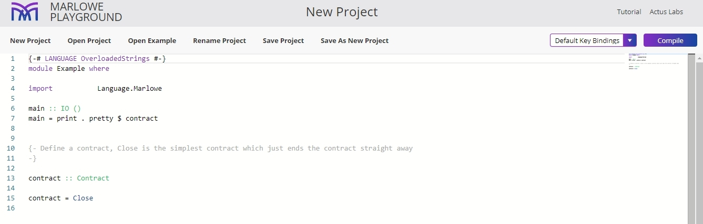

As an experienced Haskell developer you can use the Haskell editor to render Marlowe code. Marlowe is written as a Haskell data type, and thus it is straightforward to generate Marlowe smart contracts using Haskell.

To use the Haskell editor follow these steps:

1. Open the [Marlowe Playground](https://play.marlowe-finance.io).

2. Click **Start coding!** 

3. Select the Haskell version from the menu. 

    You will see a window like this:
    

4. Now you can start coding in Haskell. 
  
    Alternatively, you can use some example contracts to work with. 
    
5. Describe a contract in the editor. For this, define a top-level value contract of type `Contract`, add conditions, and close the contract. 

    The following window will open for an Escrow contract:
    

6. Click **Compile** to convert this value from Haskell into Marlowe.

7. Then, click **Send to Simulator**. 

   The Simulator allows you to simulate Marlowe contracts transaction by transaction. You can find more instructions on how to use the Haskell editor in the [Marlowe tutorial](https://play.marlowe-finance.io/doc/marlowe/tutorials/embedded-marlowe.html).
