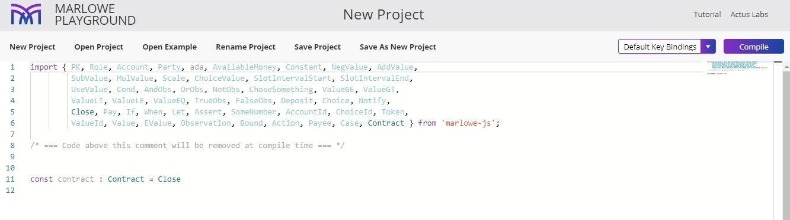

You can use the embedded JavaScript editor to write Marlowe code.

To use the editor follow these steps:

1. Open the [Marlowe Playground](https://play.marlowe-finance.io/#/).

2. Click **Start coding!** and select **Javascript** from the menu.

      You will see a window like this:
      

3. You can import values and functions from the provided library written in TypeScript. They can be used to generate Marlowe smart contracts from TypeScript or JavaScript.  

4. Describe a contract in the editor, alternatively, you can upload an example written in JavaScript. The last expression in the file needs to be of type `Contract`: below we define the top-level constant `contract` to be of that type.

5. Click **Compile** to convert this contract from Javascript into Marlowe. 

6. Then click **Send to Simulator** in the top right-hand corner. 

    You can also find more details about simulation in the [Marlowe tutorial](https://play.marlowe-finance.io/doc/marlowe/tutorials/javascript-embedding.html). 
