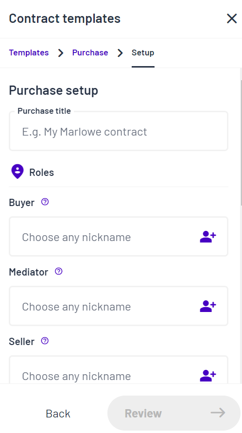

Get your smart contracts up and running in minutes. Marlowe Run provides an intuitive, straightforward, and seamless interface for you to handle financial agreements with your friends, colleagues, or clients on the blockchain. It gives you access to expertly crafted, secure smart contract templates for any type of agreement that you want to use. 

Marlowe Run is a fast and easy way to use and run contracts on Cardano. You will find a selection of financial contract templates so you can pick the right smart contract for you. Once you choose a template, you simply add in roles and terms, and then run your contract. You will be using the prototype version of Marlowe Run.

**Note**: This prototype version of Marlowe Run provides a demo version that uses test contracts and simulated funds. The full version of Marlowe Run will be available soon.

## Accessing the Marlowe Run Demo
To access and view the dashboard, follow these steps:
1. Visit the [Marlowe website](https://marlowe-finance.io/) and click **Marlowe Run** on the main menu.
2. Click **Try demo**.
3. The Marlowe Run demo is launched:

For this demo version of Marlowe Run, test wallets are generated with 10k ADA in them, so that you can use the service. You can use any wallet that exists on the server as  long as you know the public key. This will become the integration point with a real wallet in the full version of Marlowe Run, where only the wallet owner can authorize  payments.

4. Click **Generate demo wallet** to use a demo wallet.
5. Enter a nickname for your demo wallet. You can only use letters and numbers for the nickname.	

6. Click **Use**.

After you have selected your wallet, the following screen is displayed:

7. Click **Choose a template** to use a template to create your contract.

The Contract templates selection card is displayed with three options (Purchase, Loan, CFD), as follows:

8. Click the contract template you want to use, for example, Purchase.

An overview card is displayed, as follows:

9. Click **Setup** to proceed and run the contract.
10. Enter the following details for the contract:
    - Title
    - Roles: Buyer, Mediator, Seller
    - Terms: Price, Payment deadline, Complaint deadline, Complaint response deadline, Mediaton deadline
11. Then click **Review**.
12. Review the information on the confirmation card.
13. Then click **Pay and start** to run the contract.

The running contract dialog is displayed on the contracts dashboard. This shows a counter with the time allocated within which the participants must make a deposit. Depending on the contract you may need to wait for a participant to make a deposit before you can proceed. 

14. Click **Deposit** to make the required deposit. 

15. Confirm your payment by clicking **Deposit** again.
16. Click **Everything is alright** to confirm you are happy to proceed. Otherwise, you can click **Report a problem** if there is an issue.
17. Then click **Choose** to proceed. A confirmation message is displayed to confirm that the transaction was submitted successfully. 

Note that if you do not act within the allocated time period, the contract will time out and you will have to close the contract and start again. If this happens, the balance of the account will be redeemed to the owner of the role.

You can click **Close contract** at any time to close a running contract.

## Adding Contacts
You can maintain a list of your active contacts that you regularly communicate with.

To add a new contact, follow these steps:
1. Click the **Contacts** icon on the main menu.
2. Click **New contact** to record the details of a new contact.
3. Enter a nickname and the wallet ID for the contact and click **Save**. Your new contact is added to your contacts list.
