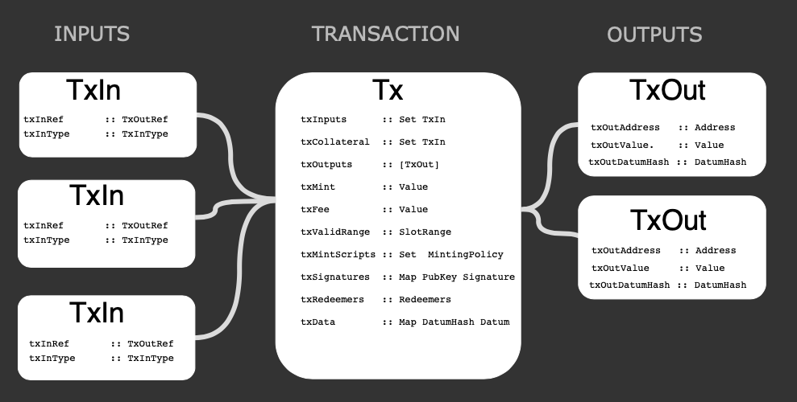

This tutorial outlines what a Plutus transaction is and how to write one. This is done in the follow sequence:

1. Write your Plutus **on chain** code.
2. Serialize your Plutus **on chain** code to the text envelope format (`cardano-cli` expects this format).
3. Create your transaction with the accompanying Plutus script(s).
4. Submit the transaction to execute Plutus script.


### What is a Plutus transaction?

A transaction is a piece of data that contains both inputs and outputs, and as of the Alonzo era, they can also include Plutus scripts. **Inputs** are unspent outputs from previous transactions (UTxO). As soon as an UTxO is used as input in a transaction, it becomes spent and can never be used again. The **output** is specified by an *address* (a public key or public key hash) and a *value* (consisting of an ADA amount and optional additional native token amounts). This flow-diagram gives a better idea of what the components of a transaction are at a technical level:




  

In short, inputs contain references to UTXOs introduced by previous transactions, and outputs are the new UTXOs that this transaction will produce. Also, if we think about it, this allows us to change the state of a smart contract since new data can be contained in the produced outputs.


It is also important to define what *Plutus Tx* is. Plutus Tx is the name given to specially-delimited sections of a Haskell program that are used to compile the on-chain part of a contract application into Plutus Core (this compiled code is then used for validating a transaction, hence the "Tx"). The resulting Plutus Core expression can be part of transaction data or data stored on the ledger. These pieces of code require special processing on the blockchain and are referred to as *Plutus script*.


**Why**

From a Plutus developer perspective, by using transactions, we can control the flow of execution of our Plutus script. Thus, a transaction can also be thought of as messages used to interact with the smart contract. Understanding transactions is a key concept to master the development of smart contracts.


**When**


A transaction ought to be created by the wallet while evaluating the off-chain code. For now, we have to assemble the transaction using cardano-cli and place the compiled Plutus script inside. At later stages though, this will be automated by the user's wallet software. The transaction, once submitted, will be validated and, therefore, the Plutus code will be evaluated by a validator node. If the script evaluates successfully, the transaction will be considered as valid. If not, the transaction will be rejected.


### Setting up the environment


If you already have a Haskell development environment set up, feel free to skip this section, otherwise follow along, we will set up a suitable environment for compiling plutus scripts using Nix, alternatively, you can follow this [guide](https://docs.cardano.org/getting-started/installing-the-cardano-node).


We will use Nix to provide both Haskell and Cabal, but if you desire, you could also rely on the ghcup tool to manage these dependencies. However, we won't cover this. You can refer to the official [ghcup](https://gitlab.haskell.org/haskell/ghcup-hs) site for instructions on that approach.


Nix is an amazing tool that, among other things, allows us to create isolated environments in which we can embed all dependencies needed for an application. These dependencies can even be system-level dependencies. Thus, we can create an isolated environment to ensure the application will work since all required dependencies are available.


Install Nix on any **Linux distribution**, **MacOS** or **Windows** (via WSL) via the recommended [multi-user installation](https://nixos.org/manual/nix/stable/#chap-installation). In short, you need to run this at your terminal:


```
sh <(curl -L https://nixos.org/nix/install) --daemon
```

To improve build speed, it is highly suggested to set up a binary cache maintained by IOHK by doing the following:

```
sudo mkdir -p /etc/nix
cat <<EOF | sudo tee /etc/nix/nix.conf
substituters = https://cache.nixos.org https://hydra.iohk.io
trusted-public-keys = iohk.cachix.org-1:DpRUyj7h7V830dp/i6Nti+NEO2/nhblbov/8MW7Rqoo= hydra.iohk.io:f/Ea+s+dFdN+3Y/G+FDgSq+a5NEWhJGzdjvKNGv0/EQ= cache.nixos.org-1:6NCHdD59X431o0gWypbMrAURkbJ16ZPMQFGspcDShjY=
EOF
```

Before Nix works in your existing shells, you need to close them and open them again. Other than that, you should be ready to go.


Once Nix is installed, log out and then log back in, so it is activated properly in your shell. Clone the following and check out the latest version of the node. Please refer to the [cardano-node releases page](https://github.com/input-output-hk/cardano-node/releases/latest) to ensure you are working with the latest version of this.

```
git clone https://github.com/input-output-hk/cardano-node
cd cardano-node
git fetch --all --recurse-submodules --tags
git checkout tags/1.29.0
```

Create a file in the root of the git repository we just cloned and save it as `plutus-tutorial.nix`:


```
{ version ? "mainnet", pkgs ? import (fetchTarball "https://github.com/NixOS/nixpkgs/archive/6525bbc06a39f26750ad8ee0d40000ddfdc24acb.tar.gz") { }}:
let
  cardano-node-repo = import ./. { };

in pkgs.mkShell {
  buildInputs = with pkgs; [
    libsodium
    cabal-install
	zlib
    haskell.compiler.ghc8104
    haskellPackages.haskell-language-server

    cardano-node-repo.scripts."${version}".node
    cardano-node-repo.cardano-cli
  ];

  CARDANO_NODE_SOCKET_PATH = "${builtins.toString ./.}/state-node-${version}/node.socket";

}
```

and then load a shell with Nix using this file with the following command:

```
nix-shell plutus-tutorial.nix
```

This will take approximately five or ten minutes the first time you do it, you should see something similar to this:

```
these paths will be fetched (445.08 MiB download, 5870.53 MiB unpacked):
/nix/store/04jc7s1006vhg3qj4fszg6bcljlyap1a-conduit-parse-0.2.1.0-doc
/nix/store/052kzx9p5fl52pk436i2jcsqkz3ni0r2-reflection-2.1.6-doc
.
.
.
/nix/store/7jq1vjy58nj8rjwa688l5x7dyzr55d9f-monad-memo-0.5.3... (34 KB left)
```

This creates an environment with all dependencies listed in the “buildInputs” section, with GHC 8.10.4 and Cabal among these.


Once you have recent versions of GHC and Cabal, make sure to use GHC 8.10.2 or later:


```
[nix-shell:~]$ ghc --version
The Glorious Glasgow Haskell Compilation System, version 8.10.4

[nix-shell:~]$ cabal --version
cabal-install version 3.4.0.0
compiled using version 3.4.0.0 of the Cabal library
```

### Running the cardano-node
Inside the nix-shell start a passive Cardano node, remember to first activate the Nix environment if you have not done so:

```
nix-shell plutus-tutorial.nix
```


**[nix-shell:~]**

```
cardano-node-mainnet
```


At this point, the node will start syncing with the network, which will come useful for submitting our transactions later. We are now ready to start building the Plutus transaction. Keep the node running in this shell, and open a new terminal to continue with the following steps. Remember to enter the nix-shell environment in this new terminal so you have both GHC and Cabal available.


### 1. Write your Plutus on chain code


We need a Haskell program to compile our desired Plutus script. In this example we will use the [plutus-alwayssucceeds](https://github.com/input-output-hk/Alonzo-testnet/tree/main/resources/plutus-sources/plutus-alwayssucceeds) Plutus script.

**Note** The “Plutus always succeeds” script is used in this tutorial *only as an example*, as it uses a very simple protection mechanism that does not perform any validation of funds. Therefore, we recommend that you do not deploy this contract on the mainnet. If you still want to deploy it on mainnet, you should use a more secure datum. 


```
git clone https://github.com/input-output-hk/Alonzo-testnet.git
cd Alonzo-testnet/resources/plutus-sources/plutus-alwayssucceeds
```

Note that, even though the program is part of the testnet examples, it will work for us on mainnet just fine.

### 2. Serialize your Plutus on chain code

By building the project, we generate a binary that compiles this script.

```
cabal update
cabal build
```


#### Execute the plutus-alwayssucceeds project

We will pick a random number. It will be passed as an argument to the Plutus script (it is not used by the script right now, but will be required by transactions using the script). The second argument is the filename we want for the compiled Plutus script.

```
cabal run plutus-alwayssucceeds -- 42 alwayssucceeds.plutus
```

You should see something like this:
```
Up to date
Writing output to: alwayssucceeds.plutus
"Log output"
[]
"Ex Budget"
ExBudget {exBudgetCPU = ExCPU 297830, exBudgetMemory = ExMemory 1100}
```

```
cat alwayssucceeds.plutus
```

You should see something like this:

```
{
    "type": "PlutusScriptV1",
    "description": "",
    "cborHex": "4e4d01000033222220051200120011"
}
```


### 3. Create your transaction with the accompanying Plutus script(s)

We will then have the Plutus script compiled. Now, we need to build the transaction, using the [cardano-cli](https://github.com/input-output-hk/cardano-node/blob/master/doc/reference/cardano-node-cli-reference.md/) project including the Plutus script.


Ensure that you have the latest tagged version era.

```
cardano-cli query tip --mainnet
```

You should now see the following:

```
{
    "epoch": 155,
    "hash": "c8ae0bb7f06743cd95c35e19c866a811b7a3f104ad362c8667b9f0a1f0907ed2",
    "slot": 36882965,
    "block": 2899736,
    "era": "Alonzo",
    "syncProgress": "100.00"
}
```


**Note:** Ensure that “era” corresponds to “Alonzo”. If you have just started the node, you might need to wait for your node to sync before you can see this. The node is not actually needed to build a transaction, but it is useful to submit the transaction to the network.


#### Generating Wallets
We must first create a payment key-pair and a wallet address if you haven't already. For this example, we need to generate two addresses as follows. For this step, generate a payment key in the corresponding address:


```
cardano-cli address key-gen \
--verification-key-file payment.vkey \
--signing-key-file payment.skey

cardano-cli stake-address key-gen \
--verification-key-file stake.vkey \
--signing-key-file stake.skey

cardano-cli address build \
--payment-verification-key-file payment.vkey \
--stake-verification-key-file stake.vkey \
--out-file payment.addr \
--mainnet
```

```
cat payment.addr
```

Make sure to generate an additional wallet using the same steps above, so you can test transactions between these addresses.


#### Build and submit a simple (non-Plutus) transaction

In this simple transaction, we send funds from one personal address to another address. Assume that we have these addresses in `payment.addr` and `payment2.addr` files and we want to send 500 ADA from the first address to the second address.


First, we need to query the UTXOs in the `payment. addr`:

```
cardano-cli query utxo --address $(cat payment.addr) --mainnet
```

Taking into account you address has a balance, you should see something like this:


```
TxHash                                                             TxIx  Amount
--------------------------------------------------------------------------------------
8c6f74370d823130847efe3d2e2e128f0e79c8e907fda692353d841dd0d6cb38   0     1000000000 lovelace + TxOutDatumHashNone
```

Using this information, we can build a transaction:

```
cardano-cli transaction build \
--alonzo-era \
--mainnet \
--change-address $(cat payment.addr) \
--tx-in 8c6f74370d823130847efe3d2e2e128f0e79c8e907fda692353d841dd0d6cb38#0 \
--tx-out $(cat payment2.addr)+500000000 \
--out-file tx.build
```

In the `--tx-in` argument we set the UTXO that we are using as input, the format of which is TxHash#TxIx.
The `--tx-out` argument determines the output of the new UTXOs, the format of which is address+amount.


As seen in the flow-diagram above, we can have one or more inputs and outputs.


What follows is to sign and submit the transaction:
```
cardano-cli transaction sign \
--tx-body-file tx.build \
--mainnet \
--signing-key-file payment.skey \
--out-file tx.signed

cardano-cli transaction submit --tx-file tx.signed --mainnet
```
```
Transaction successfully submitted.
```

Now if we query payment2.addr we will have a new UTxO containing 500 ADAs:
```
cardano-cli query utxo --address $(cat payment2.addr) --mainnet
```

```
TxHash                                                           TxIx   Amount
--------------------------------------------------------------------------------------
d7d207438c90fe611c1a14be29974b1662f8563331bf6fba4b6569e089ffa561 1      500000000 lovelace + TxOutDatumHashNone
```

```
cardano-cli query utxo --address $(cat payment.addr) --mainnet
```

```
TxHash                                                           TxIx   Amount
--------------------------------------------------------------------------------------
d7d207438c90fe611c1a14be29974b1662f8563331bf6fba4b6569e089ffa561 0      499831815 lovelace + TxOutDatumHashNone
```

We have now sent a simple transaction.

#### Transaction to lock funds
A transaction to lock funds is very similar to a simple transaction. However, it has two key differences: we lock funds to a script address instead of a common one, and we need to specify a datum hash for every output.


We use the **plutus-alwayssucceeds** Plutus validator script that we compiled earlier. This script will not check anything and will always succeed regardless of the value of the datum and redeemer.


```
{-# INLINABLE mkValidator #-}
mkValidator :: Data -> Data -> Data -> ()
mkValidator _ _ _ = ()
```

First, calculate the script address:
```
cardano-cli address build \
--payment-script-file alwayssucceeds.plutus \
--mainnet \
--out-file script.addr
```

Now the script address is in the script.addr file:

```
cat script.addr
```

We do not attach the datum to a UTXO directly but we use its hash. To get the hash of the datum, run the following cardano-cli command:

```
cardano-cli transaction hash-script-data --script-data-value 42
```
```
export scriptdatumhash=7c7c0bf83e0ed45faf3976a5ee19b4ef8bd069baab4275425161ac89d492bf82
```

Next, get the protocol parameters and save them to a file named `pparams.json` using:

```
cardano-cli query protocol-parameters \
--mainnet \
--out-file pparams.json
```


Now, we should build the transaction that will send ADA to the script address of our plutus-alwayssucceeds script. We write the transaction in a file called `tx-script.build`:

```
cardano-cli transaction build \
--alonzo-era \
--mainnet \
--change-address $(cat payment.addr) \
--tx-in d7d207438c90fe611c1a14be29974b1662f8563331bf6fba4b6569e089ffa561#0 \
--tx-out $(cat script.addr)+1379280 \
--tx-out-datum-hash ${scriptdatumhash} \
--protocol-params-file pparams.json \
--out-file tx-script.build
```

Continue to sign the transaction with the signing key `payment.skey` and save this signed transaction in a file `tx-script.signed`:


```
cardano-cli transaction sign \
--tx-body-file tx-script.build \
--signing-key-file payment.skey \
--mainnet \
--out-file tx-script.signed
```

Finally, submit the transaction:
```
cardano-cli transaction submit --mainnet --tx-file tx-script.signed
```
```
Transaction successfully submitted.
```

We can query both personal and script addresses:

```
cardano-cli query utxo --address $(cat payment.addr) --mainnet
```

```
TxHash                                                          TxIx  Amount
--------------------------------------------------------------------------------------
f5a618d579bc66e6199ae2a1ab4a73e2d8a73cba61a324c939346e9cf32bb33a 0    498284086 lovelace + TxOutDatumHashNone

```

```
cardano-cli query utxo --address $(cat script.addr) --mainnet
```
```
TxHash                                                            TxIx  Amount
--------------------------------------------------------------------------------------
f5a618d579bc66e6199ae2a1ab4a73e2d8a73cba61a324c939346e9cf32bb33a     1        1379280 lovelace + TxOutDatumHash ScriptDataInAlonzoEra "7c7c0bf83e0ed45faf3976a5ee19b4ef8bd069baab4275425161ac89d492bf82"
.
.
```

```
export plutusutxotxin=f5a618d579bc66e6199ae2a1ab4a73e2d8a73cba61a324c939346e9cf32bb33a#1
```

Now, we have sent funds to a script.


### 4. Submit transaction to execute Plutus script

To unlock funds from a script, we need the redeemer. Let’s remember that this script will always succeed regardless of the value of the redeemer, so long as we provide the correct datum. So we can use any value as a redeemer. We also need an input as collateral: it covers the fees if the transaction fails. Then, we need a UTXO with enough funds. We are going to create a simple transaction using the `payment2.addr` account as an example.

It results in two new UTXOs.

Check the balances:
```
cardano-cli query utxo --address $(cat payment2.addr) --mainnet
```
```
TxHash                                                           TxIx  Amount
--------------------------------------------------------------------------------------
d7d207438c90fe611c1a14be29974b1662f8563331bf6fba4b6569e089ffa561 1     500000000 lovelace + TxOutDatumHashNone
```

```
export txCollateral="d7d207438c90fe611c1a14be29974b1662f8563331bf6fba4b6569e089ffa561#1"
```
Construct, sign, and submit the new transaction to unlock the funds:

```
cardano-cli transaction build \
--alonzo-era \
--mainnet \
--tx-in ${plutusutxotxin} \
--tx-in-script-file alwayssucceeds.plutus \
--tx-in-datum-value 42 \
--tx-in-redeemer-value 42 \
--tx-in-collateral ${txCollateral} \
--change-address $(cat payment.addr) \
--protocol-params-file pparams.json \
--out-file test-alonzo.tx
```

If we use a UTXO that is part of a script address as an input of the transaction, we need to specify the `--tx-in-script-file --tx-in datum-value --tx-in-redeemer-value --tx-in-collateral` arguments after the `--tx-in` argument containing that UTXO:


```
cardano-cli transaction sign \
--tx-body-file test-alonzo.tx \
--signing-key-file payment.skey \
--mainnet \
--out-file test-alonzo.signed
```

```
cardano-cli transaction submit --mainnet --tx-file test-alonzo.signed
```

```
Transaction successfully submitted.
```

Now, if we query both addresses we can see that we have unlocked the funds:

```
cardano-cli query utxo --address $(cat payment2.addr) --mainnet
```
```
cardano-cli query utxo --address $(cat script.addr) --mainnet
```

At this point, you have successfully submitted your first Plutus transaction!
