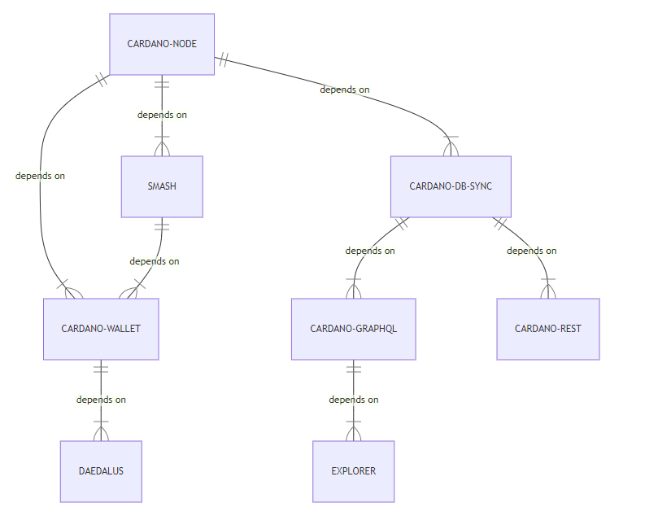

## Component Compatibility with Cardano Node

This Cardano components compatibility matrix shows the runtime Cardano component dependencies on a particular version of [cardano-node](https://github.com/input-output-hk/cardano-node/releases). (It does not reflect any stacks.) The compatibility matrix should be read in conjunction with the Cardano component dependencies definition.

Please note that [node version 1.24.2](https://github.com/input-output-hk/cardano-node/releases/tag/1.24.2) is the only node version that will work following the token locking Cardano update.

| [Cardano Node](https://github.com/input-output-hk/cardano-node/releases) | [Cardano DB Sync](https://github.com/input-output-hk/cardano-db-sync/releases) | [Smash](https://github.com/input-output-hk/smash/releases) | [Cardano Rest](https://github.com/input-output-hk/cardano-rest/releases) | [Cardano GraphQL](https://github.com/input-output-hk/cardano-graphql/releases) | [Cardano Explorer](https://github.com/input-output-hk/cardano-explorer-app/releases) | [Cardano Wallet](https://github.com/input-output-hk/cardano-wallet/releases) | 
|---|---|---|---|---|---|---|
| __[1.27](https://github.com/input-output-hk/cardano-node/releases/tag/1.27.0)__ | | | | | |[2021-06-11](https://github.com/input-output-hk/cardano-wallet/releases/tag/v2021-06-11) |
| __[1.26.2](https://github.com/input-output-hk/cardano-node/releases/tag/1.26.2)__ | [9.0.0](https://github.com/input-output-hk/cardano-db-sync/releases/tag/9.0.0)  | | | | | |
| __[1.25.1](https://github.com/input-output-hk/cardano-node/releases/tag/1.25.1)__ | [8.0.0](https://github.com/input-output-hk/cardano-db-sync/releases/tag/8.0.0), [9.0.0](https://github.com/input-output-hk/cardano-db-sync/releases/tag/9.0.0)  | [1.4.0](https://github.com/input-output-hk/smash/releases/tag/v1.4.0) | [3.1.2](https://github.com/input-output-hk/cardano-rest/releases/tag/3.1.2) |  [3.2.0](https://github.com/input-output-hk/cardano-graphql/releases/tag/3.2.0) | [1.4.0](https://github.com/input-output-hk/cardano-explorer-app/releases/tag/1.4.0) | [2021.02.12](https://github.com/input-output-hk/cardano-wallet/releases/tag/v2021-02-12), [2021.02.15](https://github.com/input-output-hk/cardano-wallet/releases/tag/v2021-02-15) |
| __[1.24.2](https://github.com/input-output-hk/cardano-node/releases/tag/1.24.2)__ | [7.1.0](https://github.com/input-output-hk/cardano-db-sync/releases/tag/7.1.0)  | [1.3.0](https://github.com/input-output-hk/smash/releases/tag/1.3.0) |  [3.1.1](https://github.com/input-output-hk/cardano-rest/releases/tag/3.1.1) | [3.1.1](https://github.com/input-output-hk/cardano-graphql/releases/tag/3.1.1)  | [1.2.1](https://github.com/input-output-hk/cardano-explorer-app/releases/tag/1.2.1) | [2020.12.21](https://github.com/input-output-hk/cardano-wallet/releases/tag/v2020-12-21), [2020.01.12](https://github.com/input-output-hk/cardano-wallet/releases/tag/v2021-01-12) |
| __[1.21.1](https://github.com/input-output-hk/cardano-node/releases/tag/1.21.1)__ | [5.0.2](https://github.com/input-output-hk/cardano-db-sync/releases/tag/5.0.2), [5.0.3](https://github.com/input-output-hk/cardano-db-sync/releases/tag/5.0.3), [6.0.0](https://github.com/input-output-hk/cardano-db-sync/releases/tag/6.0.0)  | [1.2.0](https://github.com/input-output-hk/smash/releases/tag/1.2.0)  |   | [2.2.1](https://github.com/input-output-hk/cardano-graphql/releases/tag/2.2.1)  |  | [2020.10.13](https://github.com/input-output-hk/cardano-wallet/releases/tag/v2020-10-13) |
| __[1.20.0](https://github.com/input-output-hk/cardano-node/releases/tag/1.20.0)__ | [5.0.1](https://github.com/input-output-hk/cardano-db-sync/releases/tag/5.0.1),  [5.0.3](https://github.com/input-output-hk/cardano-db-sync/releases/tag/5.0.3)  |   |   | [2.2.0](https://github.com/input-output-hk/cardano-graphql/releases/tag/2.2.0)  | [1.2.0](https://github.com/input-output-hk/cardano-explorer-app/releases/tag/1.2.0) | [2020.9.22](https://github.com/input-output-hk/cardano-wallet/releases/tag/v2020-09-22), [2020.9.30](https://github.com/input-output-hk/cardano-wallet/releases/tag/v2020-09-30) |
| __[1.19.1](https://github.com/input-output-hk/cardano-node/releases/tag/1.19.1)__ | [5.0.0](https://github.com/input-output-hk/cardano-db-sync/releases/tag/5.0.0), [5.0.1](https://github.com/input-output-hk/cardano-db-sync/releases/tag/5.0.1), [5.0.3](https://github.com/input-output-hk/cardano-db-sync/releases/tag/5.0.3)  |   |   | [2.1.0](https://github.com/input-output-hk/cardano-graphql/releases/tag/2.1.0) |  [1.1.0](https://github.com/input-output-hk/cardano-explorer-app/releases/tag/1.1.0)  | [2020.9.11](https://github.com/input-output-hk/cardano-wallet/releases/tag/v2020-09-11) |
| __[1.19.0](https://github.com/input-output-hk/cardano-node/releases/tag/1.19.0)__ |   | [1.1.0](https://github.com/input-output-hk/smash/releases/tag/1.1.0)  |   |   |  |  |
| __[1.18.0](https://github.com/input-output-hk/cardano-node/releases/tag/1.18.0)__ |  [4.0.0](https://github.com/input-output-hk/cardano-db-sync/releases/tag/4.0.0) |   |   |   |  |  |
| __[1.18.0](https://github.com/input-output-hk/cardano-node/releases/tag/1.18.0)__ |  [3.1.0](https://github.com/input-output-hk/cardano-db-sync/releases/tag/3.1.0) |[1.0.1](https://github.com/input-output-hk/smash/releases/tag/1.0.1)  | [2.1.3](https://github.com/input-output-hk/cardano-rest/releases/tag/2.1.3)  | [2.0.0](https://github.com/input-output-hk/cardano-graphql/releases/tag/2.0.0)  |  [1.0.1](https://github.com/input-output-hk/cardano-explorer-app/releases/tag/1.0.1)  | [2020.8.3](https://github.com/input-output-hk/cardano-wallet/releases/tag/v2020-08-03) |

The following diagram outlines the various component dependencies:

